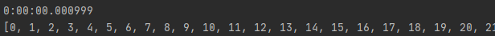

# Содержание
- [ЛР № 5–6](#лабораторная-работа--56)
- [ИСР № 2](#инвариативная-самостоятельная-работа--2)
    - [1 задание](#21-разработка-программы-калькулятор-выполняющей-базовые-арифметические-действия-и-функции-обёртки-для-логирования-операций)
    - [2 задание](#22-дополнение-программы-калькулятордекоратором-сохраняющим-выполнимые-действия-в-файл-журнал)
    - [3 задание](#23-рефакторинг-программы-с-декоратором-модулем-functools-и-использование-его-функционала)
- [ВСР № 2](#вариативная-самостоятельная-работа--2)

# [Лабораторная работа № 5–6](https://repl.it/@Rakleed/programming4-lab5-6)
```python
import sqlite3
import functools


def once(func):
    @functools.wraps(func)
    def inner(*args, **kwargs):
        print(func.__name__, func.__doc__, args, kwargs)
        if not inner.called:
            conn = func(*args, **kwargs)
            inner.called = True
            print("Called is changed.")
            return conn
    print("Init")
    inner.called = False
    return inner


@once
def connect_to_db(path_to_db):
    connection = None
    if path_to_db:
        try:
            connection = sqlite3.connect(":memory:")
        except:
            return None
        else:
            c = connection.cursor()
            return {"conn": connection, "cursor": c}
    return connection


def wrapper(conn, table):
    auth_stat = False
    login = str(input("Введите логин: "))
    password = str(input("Введите пароль: "))
    user_query = "SELECT * FROM " + str(table) + " WHERE login=" + "'" + login + "'"
    cursor = conn.cursor()
    res = cursor.execute(user_query)
    user_info = res.fetchall()
    if not user_info:
        print("Нет такого пользователя.")
        return auth_stat
    print(user_info)
    role = ''
    if user_info[0][1] == password:
        print(private_zone_area())
    else:
        print("Пользователя с таким паролем не существует.")
        return auth_stat
    if (user_info[0][0]) == "root":
        print("Вы зашли как root.")
        role = "0"
    elif (user_info[0][0]) == "admin":
        print("Вы зашли как admin.")
        role = "1"
    else:
        print("Вы зашли как обычный пользователь.")
        role = "2"
    return role


def private_zone_area():
    return "private_zone_area"


def get_users_from_table(conn, table):
    sql_query = "SELECT * FROM " + str(table)
    cursor = conn.cursor()
    res = cursor.execute(sql_query)
    users_list = res.fetchall()
    return users_list


def main():
    conn_dict = connect_to_db("file.db")
    conn, cur = conn_dict["conn"], conn_dict["cursor"]
    try:
        sql_query = '''CREATE TABLE users
            (login text, pass text, role int)'''
        cur.execute(sql_query)
    except sqlite3.OperationalError as e:
        e_string = str(e)
        if "already exists" in e_string:
            print(f' NOTICE: {e}. CONTINUE ')
    else:
        sql_query = '''INSERT INTO users VALUES (?, ?, ?)'''
        users_list = [("root", "123", 0), ("admin", "789", 1),
                      ("user", "qwe", 2)]
    try:
        cur.executemany(sql_query, users_list)
        conn.commit()
    except sqlite3.Error as e:
        print(f'Error with adding users to db. {e}')
    users = get_users_from_table(conn, "users")
    print(users)
    user_role = False
    while user_role == False:
        user_role = wrapper(conn, "users")
        if user_role == False:
            print("Выйти?")
            if str(input("Да/Нет: ")) == "Да":
                conn.close()
                cur, conn = None, None
                return 0
    conn.close()
    cur, conn = None, None


main()
```
[file.db](src/file.db)


# Инвариативная самостоятельная работа № 2
### [2.1. Разработка программы «Калькулятор», выполняющей базовые арифметические действия, и функции обёртки для логирования операций.](https://repl.it/@Rakleed/programming4-indepworkinvar2-1)
```python
"""
    Автор: Моисеенко Павел, группа № 1, подгруппа № 2.

    ИСР 2.1. Задание: разработать прототип программы «Калькулятор»,
    позволяющую выполнять базовые арифметические действия и функцию
    обертку, сохраняющую название выполняемой операции, аргументы и
    результат в файл (без использования '@').

"""


def save_result_in_file(what_to_write):
    try:
        file_handler = open("log.txt", "a")
        file_handler.write(what_to_write)
    except IOError:
        print("An IOError has occurred!")
    except:
        print("Непредвиденная ошибка.")
    finally:
        file_handler.close()


def calc():
    string_write_buff = ""
    is_work = True
    while is_work:
        string_calc = input("Введите выражение в форме <число><пробел><мат.оп"
                            "ерация><пробел><число> (или «q» для выхода): ")
        if string_calc.lower() == "q":
            save_result_in_file(string_write_buff)
            exit()
        list_from_user_string = string_calc.split()
        if list_from_user_string[1] == "+":
            result = float(list_from_user_string[0]) + \
                     float(list_from_user_string[2])
        elif list_from_user_string[1] == "-":
            result = float(list_from_user_string[0]) - \
                     float(list_from_user_string[2])
        elif list_from_user_string[1] == "*":
            result = float(list_from_user_string[0]) * \
                     float(list_from_user_string[2])
        elif list_from_user_string[1] == "/":
            result = float(list_from_user_string[0]) / \
                     float(list_from_user_string[2])
        else:
            print("Error.")
        try:
            string_write_buff += string_calc + " = " + str(result) + "\n"
        except UnboundLocalError:
            print("Ошибка передачи данных.")
        print(string_calc + " = " + str(result))
    return string_write_buff


if __name__ == "__main__":
    calc()
```


### [2.2. Дополнение программы «Калькулятор» декоратором, сохраняющим выполнимые действия в файл-журнал.](https://repl.it/@Rakleed/programming4-indepworkinvar2-2)
```python
"""
    Автор: Моисеенко Павел, группа № 1, подгруппа № 2.

    ИСР 2.2. Задание: дополнить программу «Калькулятор» декоратором,
    сохраняющим выполняемые действия в файл-журнал.

"""


def save_result_in_file(func):
    try:
        file_handler = open("log.txt", "a")
        file_handler.write(func())
    except IOError:
        print("An IOError has occurred!")
    except UnboundLocalError:
        print("Непредвиденная ошибка.")
    finally:
        file_handler.close()


@save_result_in_file
def calc():
    string_write_buff = ""
    is_work = True
    while is_work:
        string_calc = input("Введите выражение в форме <число><пробел><мат.оп"
                            "ерация><пробел><число> (или «q» для выхода): ")
        if string_calc.lower() == "q":
            break
        list_from_user_string = string_calc.split()
        if list_from_user_string[1] == "+":
            result = float(list_from_user_string[0]) + \
                     float(list_from_user_string[2])
        elif list_from_user_string[1] == "-":
            result = float(list_from_user_string[0]) - \
                     float(list_from_user_string[2])
        elif list_from_user_string[1] == "*":
            result = float(list_from_user_string[0]) * \
                     float(list_from_user_string[2])
        elif list_from_user_string[1] == "/":
            result = float(list_from_user_string[0]) / \
                     float(list_from_user_string[2])
        else:
            print("Error.")
        try:
            string_write_buff += string_calc + " = " + str(result) + "\n"
        except UnboundLocalError:
            print("Ошибка передачи данных.")
        print(string_calc + " = " + str(result))
    return string_write_buff


if __name__ == "__main__":
    try:
        calc()
    except:
        print("Not callable.")
```


### [2.3. Рефакторинг программы с декоратором-модулем functools и использование его функционала.](https://repl.it/@Rakleed/programming4-indepworkinvar2-3)
```python
"""
    Автор: Моисеенко Павел, группа № 1, подгруппа № 2.

    ИСР 2.3. Задание: отрефакторить программу с декоратором-модулем
    functools и использовать его функционал.

"""

import functools
save_in_file = False


def save_result_in_file(function):
    @functools.wraps(function)
    def inner():
        try:
            file_handler = open("log.txt", "a")
            file_handler.write(function())
        except IOError:
            print("An IOError has occurred!")
        except UnboundLocalError:
            print("Непредвиденная ошибка.")
        finally:
            file_handler.close()
    return inner if save_in_file else function


@save_result_in_file
def calc():
    string_write_buff = ""
    is_work = True
    while is_work:
        string_calc = input("Введите выражение в форме <число><пробел><мат.оп"
                            "ерация><пробел><число> (или «q» для выхода): ")
        if string_calc.lower() == "q":
            break
        list_from_user_string = string_calc.split()
        if list_from_user_string[1] == "+":
            result = float(list_from_user_string[0]) + \
                     float(list_from_user_string[2])
        elif list_from_user_string[1] == '-':
            result = float(list_from_user_string[0]) - \
                     float(list_from_user_string[2])
        elif list_from_user_string[1] == "*":
            result = float(list_from_user_string[0]) * \
                     float(list_from_user_string[2])
        elif list_from_user_string[1] == "/":
            result = float(list_from_user_string[0]) / \
                     float(list_from_user_string[2])
        else:
            print("Error.")
        try:
            string_write_buff += string_calc + " = " + str(result) + "\n"
        except UnboundLocalError:
            print("Ошибка передачи данных.")
        print(string_calc + " = " + str(result))
    return string_write_buff


if __name__ == "__main__":
    try:
        calc()
    except NameError:
        print('Not callable.')
```


# [Вариативная самостоятельная работа № 2](https://repl.it/@Rakleed/programming4-indepworkvar2)
```python
"""
    Автор: Моисеенко Павел, группа № 1, подгруппа № 2.

    ВСР 2. Задание: разработать функцию-декоратор, вычисляющую время
    выполнения декорируемой функции.

"""

from datetime import datetime


def lead_time(func):
    def wrapper():
        start = datetime.now()
        result = func()
        print(datetime.now() - start)
        return result
    return wrapper


@lead_time
def number():
    list_of_numbers = []
    for i in range(10000):
        list_of_numbers.append(i)
    return list_of_numbers


print(number())
```

